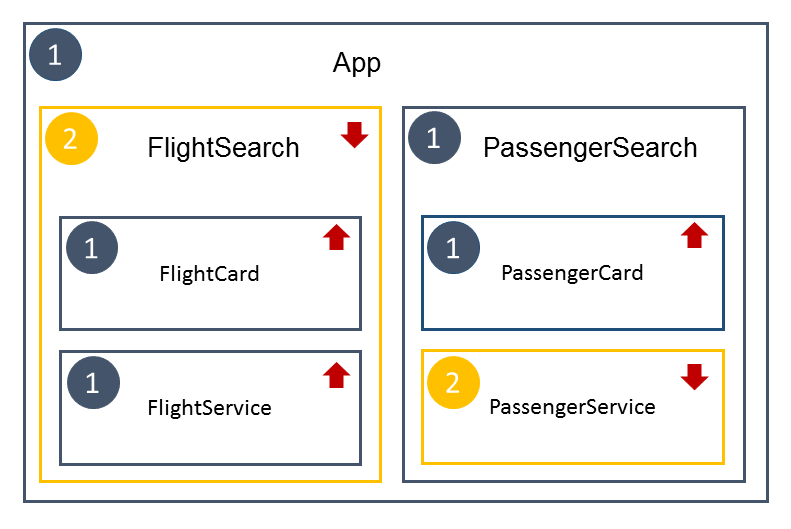

# Sample for ngUpgrade with AOT

## Overview

## Structure

- ``app/app.module.ts``: Angular 1 module
- ``app/app2.module.ts``: Angular 2 module
- ``app/app.ts``: Bootstraps the hybrid application

## Build and Start

- Build: ``npm run build`
    - Runs ngc and webpack
- Start: ``npm start``
    - Does not create a build, so run ``npm run build`` before
    - Starts live-server
   